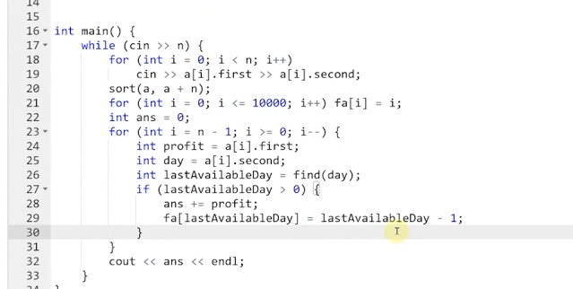

/*
https://www.acwing.com/problem/content/147/

超市里有 N 件商品，每件商品都有利润 pi 和过期时间 di，每天只能卖一件商品，过期商品不能再卖。

求合理安排每天卖的商品的情况下，可以得到的最大收益是多少。

输入格式

	输入包含多组测试用例。

	每组测试用例，以输入整数 N
	开始，接下来输入 N 对 pi 和 di，分别代表第i件商品的利润和过期时间。

	在输入中，数据之间可以自由穿插任意个空格或空行，输入至文件结尾时终止输入，保证数据正确。

输出格式

	对于每组产品，输出一个该组的最大收益值。
	每个结果占一行。

数据范围
	0≤N≤10000, 1≤pi,di≤10000
	最多有 14 组测试样例

*/

/*

思路：
	输入n件产品各自的利润和过期时间, 产品每天卖一件
	输出该n件产品的最大收益值
		最大收益 = 尽可能少的使产品过期, 过期时间相同时，选利润高的卖

*/

使用并查集的路径压缩巧解, 问题本身转换为"查找过期时间之前的空闲日"

处理之前需要先根据利润进行排序, 因为利润高的商品要优先卖

从末尾开始，查找过期时间之前的空闲日，找到后ans累加利润，继续找，直到所有商品都卖完

